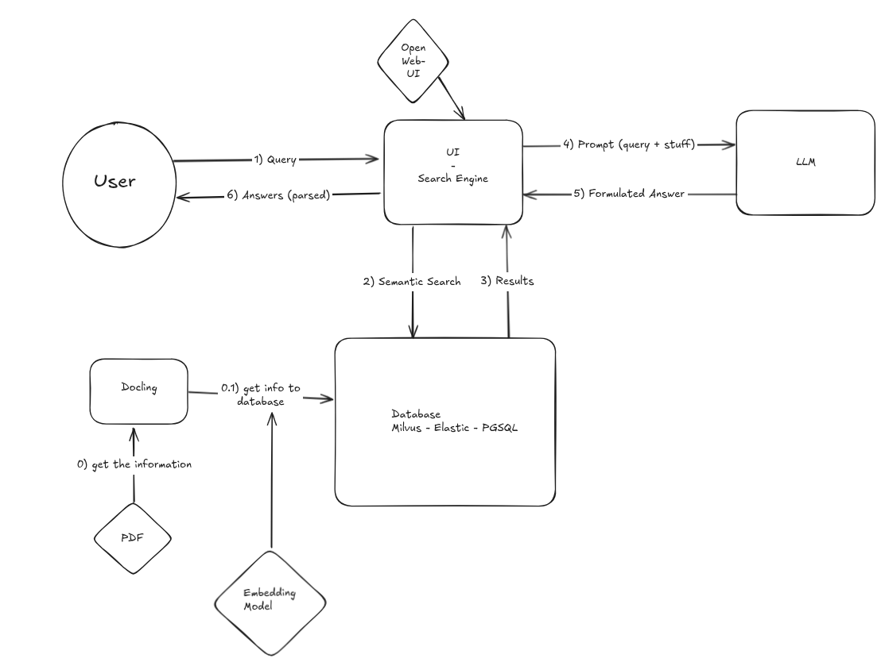
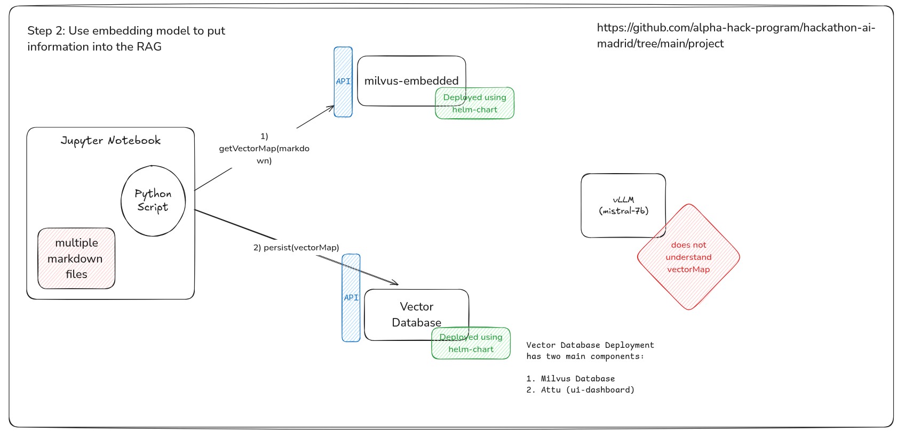
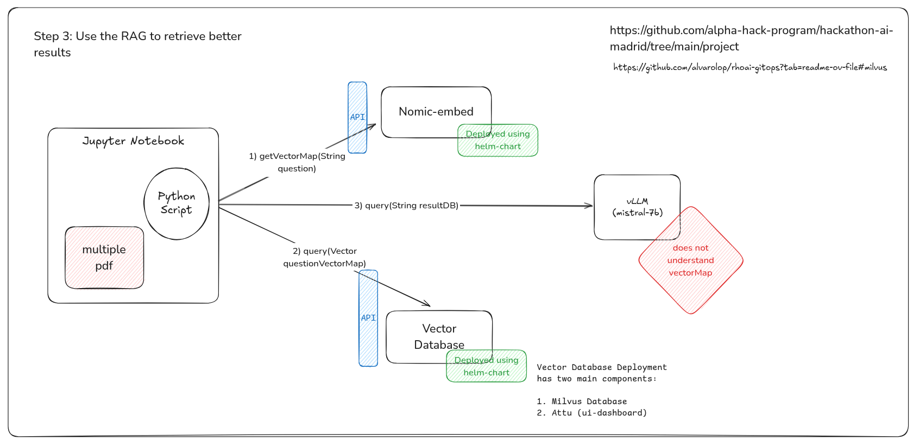
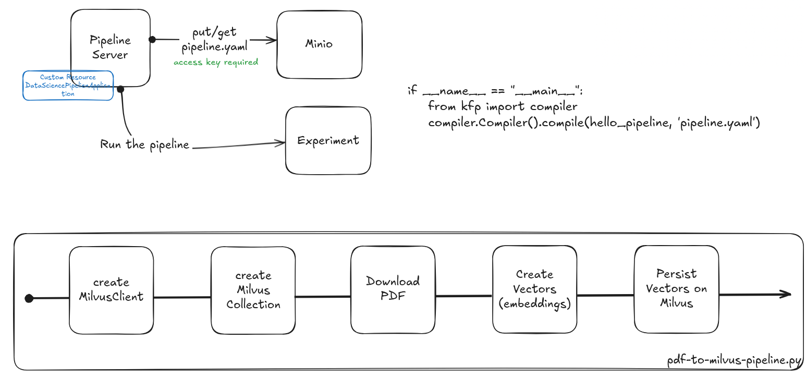

# 💻 OpenShift AI | Hackathon 💻


The aim of our Group at the 2025 AI Hackathon Madrid was to create an **alternative product search** based on a **LLM utilizing a RAG architecture**. Currently our product docs reference different documents when searching for a specific term or question. This can cause difficulties when trying to search for specific pieces of information related to the area of a product you are working with. We created a POC that takes in data from Red Hat Openshift AI documentation and provides an answer to a question in a chat format.

## 🛠️ Initial deployed Infrastructure

1. **OpenShift on AWS** was deployed using [Alvaro's scripts](https://github.com/alvarolop/ocp-on-aws).  
2. **RHOAI** was deployed using [Alvaro's scripts](https://github.com/alvarolop/rhoai-gitops/tree/c1ab1577d320d43fad41b52203a302ffc4af21f4?tab=readme-ov-file#32-lets-install).
3. Several components were deployed using GitOps and the same repository:
   1. **Inference Server for Mistral** using [ArgoCD app](https://github.com/alvarolop/rhoai-gitops/blob/c1ab1577d320d43fad41b52203a302ffc4af21f4/application-serve-mistral-7b.yaml).
   2. **Inference Server for Nomic Embed** using [ArgoCD app](https://github.com/alvarolop/rhoai-gitops/blob/c1ab1577d320d43fad41b52203a302ffc4af21f4/application-serve-nomic-embed-text-v1.yaml).
   3. **Milvus** using [ArgoCD app](https://github.com/alvarolop/rhoai-gitops/blob/c1ab1577d320d43fad41b52203a302ffc4af21f4/application-milvus.yaml).
   4. **Open WebUI** using [ArgoCD app](https://github.com/alvarolop/rhoai-gitops/blob/c1ab1577d320d43fad41b52203a302ffc4af21f4/application-open-webui.yaml).
---


## 📐 RAG Architecture

The following architecture was implemented to solve the problem statement:



## ✏️ Simplified Diagrams

Once the architecture is designed, we need to outline two main flows: **Data Ingestion** and **Query Execution**.

### 1. Data Ingestion to RAG (Retrieval-Augmented Generation)

This flow involves preparing and storing data for efficient retrieval by the RAG pipeline. Here’s an overview of the process:

- **Source:** We extract documents from the [Red Hat website](https://www.redhat.com).
- **Data Processing:** Using a Python notebook, the documents are processed and converted into vector representations.
- **Storage:** The vectors are stored in an external instance of [Milvus](https://milvus.io), a high-performance vector database.
- **Visualization:** The ingestion process and data quality are monitored using [Nomic](https://nomic.ai), which is also externally served.

Below is a diagram illustrating the data ingestion flow:



### 2. Query Execution with Mistral vLLM

The query execution flow involves retrieving contextual data from Milvus and querying the language model for insights. The steps include:

- **Context Retrieval:** Relevant vectors are retrieved from Milvus based on the input query.
- **Contextual Querying:** The retrieved context is used to query the [Mistral vLLM](https://github.com/mistralai/mistral) for detailed responses.
- **Tools Integration:** Like in the ingestion flow, Nomic and Milvus play a crucial role in visualizing and managing the pipeline.

This structured approach ensures seamless integration of data ingestion and querying, leveraging state-of-the-art tools to create a robust RAG system.




### 3.⚗️ Kubeflow Pipeline to Ingest documents

This pipeline facilitates the ingestion of data for Retrieval-Augmented Generation (RAG) by automating the processing, vectorization, and storage of documents. Below is a detailed description of the workflow:

1. **Metadata Extraction**  
   Document metadata (e.g., product name, version, section, and language) is derived from the document URL.

2. **PDF Conversion**  
   Documents are downloaded and converted into a structured format using the `docling` library.

3. **Vector Creation**  
   The document's content is split into chunks, which are then vectorized for retrieval purposes.

4. **Storage in Milvus**  
   Vectorized chunks are stored in [Milvus](https://milvus.io), a high-performance vector database.

5. **Pipeline Compilation**  
   The workflow is compiled as a pipeline for execution using [Kubeflow Pipelines (KFP)](https://www.kubeflow.org/docs/components/pipelines/).




After the pipeline is defined, you can run the following command to generate the `.yaml` file:

```bash
pip install kfp

python download-persist-pdf-to-milvus.py
```

Later, you will be able to access the RHOAI Dashboard, go to the Pipelines Server section and upload the pipeline manually.
